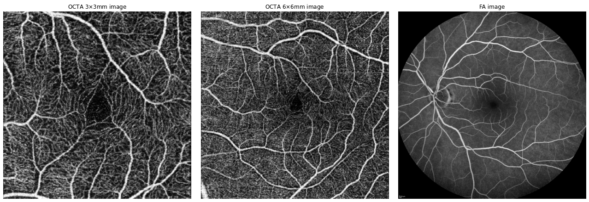
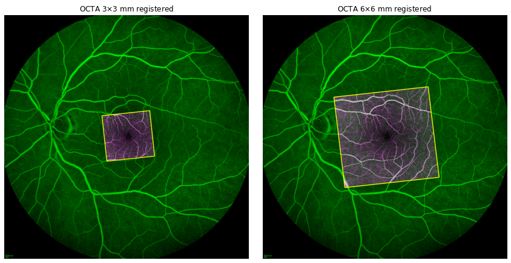

# FA-OCTA Image registration
**Authors:** Javier Martínez (that's me! :smirk:) & [Enrique J. Carmona](http://www.ia.uned.es/~ejcarmona/) & [Daniel Cancelas](https://github.com/DanielCancelas) 

## Introduction
This repository contains the code necessary to perform OCTA (Optical Coherence Tomography Angiography) and Fluorescein Angiography (FA) image registration, although it could also be used with other dye angiography such as Indocyanine Green Angiography (ICGA). Details of the method used can be found in our article, so if you use this project, please do not forget to quote us:

    @article{MartinezRio2021,
        title = {Robust multimodal registration of fluorescein angiography and optical coherence tomography angiography images using evolutionary algorithms},
        journal = {Computers in Biology and Medicine},
        volume = {134},
        pages = {104529},
        year = {2021},
        issn = {0010-4825},
        doi = {https://doi.org/10.1016/j.compbiomed.2021.104529},
        url = {https://www.sciencedirect.com/science/article/pii/S0010482521003231},
        author = {Javier Martínez-Río and Enrique J. Carmona and Daniel Cancelas and Jorge Novo and Marcos Ortega},
        keywords = {Multimodal image registration, OCT-Angiography, Fluorescein angiography, Differential evolution, Template matching},
    }

OCTA images represent a local region, while dye angiography images typically represents a global image of the eye. In the image below you can see two OCTA images taken at different resolutions (3x3mm and 6x6mm, respectively), and the third image shows an FA image. All images belong to the same patient.

With this project, you can register these OCTA images with their respective FA image (in this case it is the same, since all the images belong to the same patient):

---

## Dataset: FOCTAIR

Fluorescein and Optical Coherence Tomography Angiography image registration dataset (FOCTAIR). This dataset contains a total of 86 cases obtained from a total of 29 patients. Each case corresponds to a patient's eye and has three images: one FA image (1536x1536 px) and two OCTA images of the superficial capillary plexus corresponding to two different zoom levels: 3x3mm and 6x6mm (both have the same size: 320x320 px.). In total, there are 172 possible registrations (86 pairs of FA and OCTA 3x3mm and 86 pairs of FA and OCTA 6x6mm). 

If you are interested in using the FOCTAIR dataset, you can request access to the [VARPA research group.](http://www.varpa.es/research/ophtalmology.html)

---

## Requierements
You need Python 3.6 or later to run this project. Additionally, it is necessary to install a series of dependencies. The current versions of the respective tools used are:

- numpy 1.19.1
- opencv 3.4.2
- skimage 0.16.2
- scikit_image 0.16.2
- scikit_learn 0.23.2
- matplotlib 3.3.1
- scipy 1.5.2
- tqdm 4.46.1

